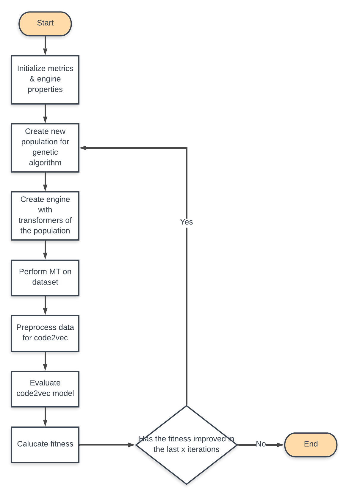

# Guided-MT-Code2vec
This repository works with genetic programming to optimize metrics for code2vec method name prediction.
The rough architecture for this is depicted in the image below. (This will be updated asap)


This is still under development

## Build & Run

To build the project, simply do:

```sh
mvn clean package verify
```

To build an executable:

```sh
mvn package verify
```

## How to get started

It's highly recommended that new users start by looking at both other projects that are used here, code2vec and Lampion.
Code2Vec is used for evaluating its trained model, besides that the Lampion project is used for the Java metamorphic transformers.

To get started with the project you

1. Download a trained code2vec model
2. Adjust paths and dataset names in preprocess.sh
3. Adjust paths and dataset in PipelineSupport.java
4. As a dataset you can you use the provided one in ./code2vec/data, or you can download your own. (The next sections describes how this projects got its test datasets.)
5. If you do download your own dataset there might occur errors with the spoon library. These can be resolved by running the EditData.py script

## Dataset

For the datasets used in our experiments we randomly selected 30 from the java-small dataset provided by code2vec
through the following link: 

```sh
wget https://s3.amazonaws.com/code2vec/data/java-small_data.tar.gz
```

As mentioned the dataset we used is provided in ./code2vec/data. However, you can also generate your own random dataset
by executing the filePicker.sh script located in ./scripts. To do this only the directory and target paths need to be changed.

## Requirements

- Maven
- Jdk 17
- Python 3.9
