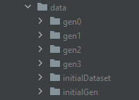

# Flow for the files of the Guided-MT-Code2vec program

In this document the flow of the input directories are defined, and the preferences of the code2vec program are defined. By reading this you 
should get a better understanding of how the input needs to be defined.

## Prerequisites

Besides, the bottom points we also need to code2vec/data folder in this project to be empty, and we need the compose_output folder to be deleted. 
If, either of this is not done the program will throw an error.

### Docker input

The docker input is defined in the docker-compose files. In this input folder all .java files for the initial dataset need to be defined. If this 
folder is empty or wrongly defined the program will throw an error.

### Code2vec preferences

Code2vec needs all its input data in the "code2vec/data" folder. However, in this folder there can be other folders with specific generations.
The Guided-MT-Code2vec program uses this to create the different individuals and puts them in different folders. 

## Folder flow during runtime

At the start of the program the files configured at for the docker input are copied to the initialDataset folder in the data directory for 
code2vec. This will be the input for the transformations and our base dataset.
Afterwards, the baseline performance is measured on an individual without any transformations. This is done in the initialGen folder. For the 
following generations new folders will be created which are called "genX" where 'X' is the current generation of the genetic algorithm. In all these 
folders the .java files are defined with a corresponding .json file for the individual with all the information.
An example of how the data folder can look after a small run is given in the image below: 

